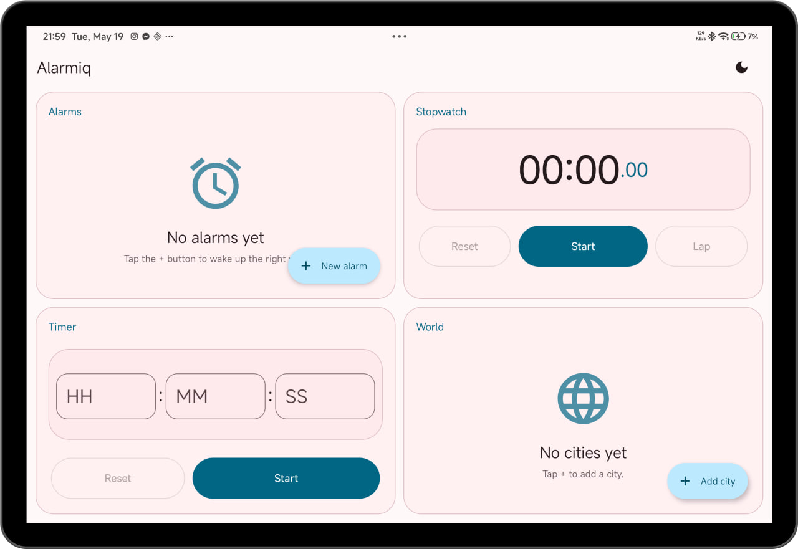
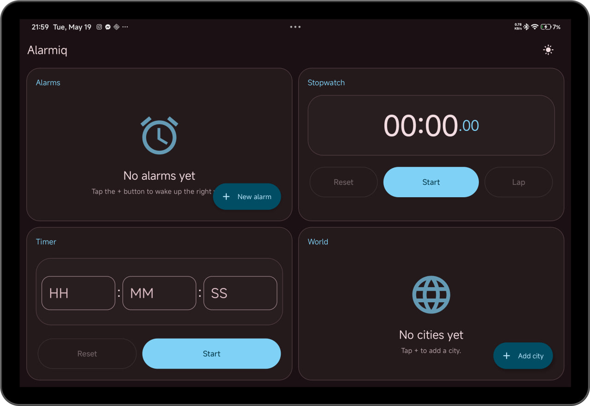
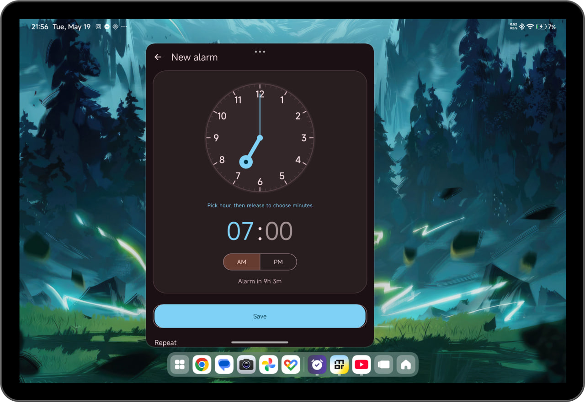

# Alarmiq ⏰

Alarmiq is a modern, feature-rich Android clock application built with a focus on precision, aesthetics, and user experience. It combines essential timekeeping tools with a unique "IQ" challenge system to ensure you wake up sharp and ready for the day.


## 📸 Screenshots

| Light Mode | Dark Mode | Tablet Dashboard |
|:---:|:---:|:---:|
|  |  |  |

## ✨ Features

### 🔔 Smart Alarms
- **Dynamic IQ Challenges**: Solve procedurally generated math problems (from Easy to Punishment difficulty), or tackle complex, dynamically built linguistic and typing challenges to dismiss your alarm.
- **No Muscle Memory**: Every challenge is unique, ensuring you can\'t memorize answers or rely on repetitive typing patterns.
- **Precision Scheduling**: Uses `AlarmManager`\'s exact alarm features to ensure you never miss a beat.

### ⏱️ Precision Timer & Stopwatch
- **Reliable Timer**: A persistent timer that survives app restarts and process death.
- **Lap Support**: Track your performance with a high-precision stopwatch and lap recording.

### 🌍 World Clock
- **Global Reach**: Track time across hundreds of cities worldwide.
- **Visual Clarity**: Compare time zones at a glance with a clean, intuitive interface.

### 🎨 Modern Design
- **Material 3**: Fully embraces the latest Material Design standards.
- **Dynamic Colors**: Adapts its color palette based on your device's wallpaper (Android 12+).
- **Day/Night Modes**: Seamlessly switch between light and dark themes with a dedicated toggle.
- **Adaptive Layouts**: Optimized for both phones and tablets with a responsive multi-pane UI.

## 🛠️ Technical Highlights

- **Architecture**: Modular and clean separation of concerns (UI, Logic, Data).
- **Persistence**: Lightweight JSON-based storage using `SharedPreferences`.
- **Services**: Foreground services with `mediaPlayback` type for reliable alarm ringing.
- **Modern Components**: Built with `ViewPager2`, `CoordinatorLayout`, and `FragmentStateAdapter`.

## 🚀 Getting Started

1. **Clone the repo**:
   ```bash
   git clone https://github.com/yourusername/Alarmiq.git
   ```
2. **Open in Android Studio**:
   Ensure you have the latest version of Android Studio (Ladybug or newer).
3. **Build & Run**:
   Connect your device or emulator and hit **Run**.

## 🤝 Contributing

Contributions are welcome! Whether it's fixing a bug, adding a new challenge type, or improving the UI, feel free to open a Pull Request.

---
*Built with ❤️ for a better morning.*
